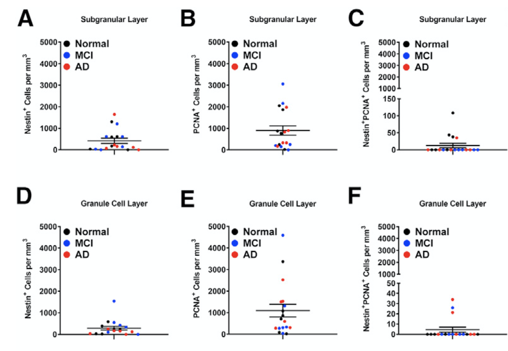
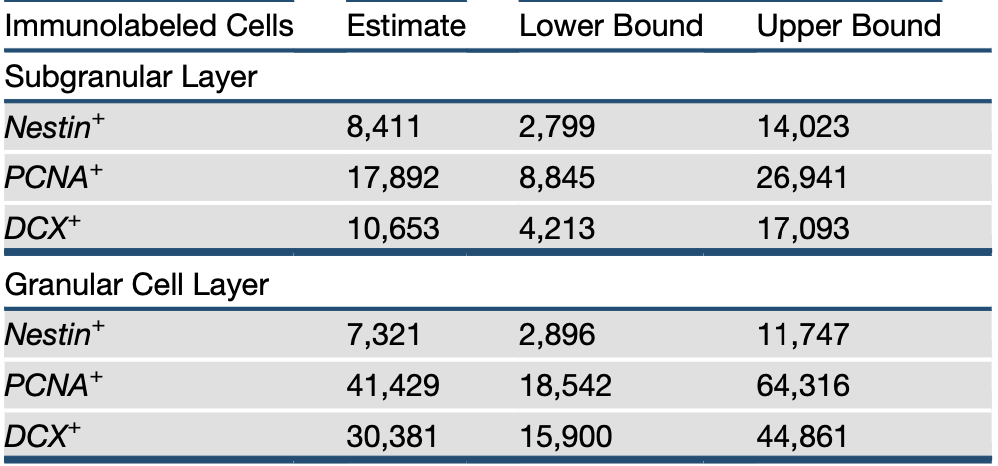
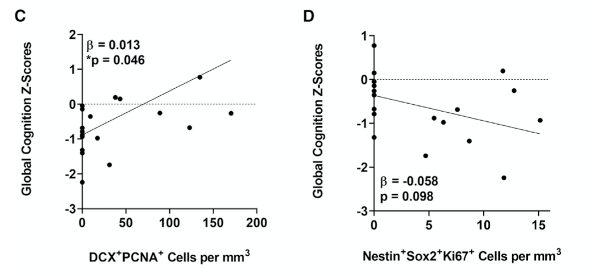

```{r setup, include=FALSE}
knitr::opts_chunk$set(echo = TRUE)


```

# Introduction
### Description of Goals of Paper: 
Adult Neurogeneis, or the birth of new neurons in the adult brain, is a topic that has been debated heavily for decades. This paper provides evidence that neurogenesis exists late in life, utilizing tissue from a cohort of people in their 80s and 90s to look for cellular markers of new cells. Tobin et al., showed that cells staining for markers implicated in neurogeneiss, like Nestin, Sox2 and DCX, localized in the dentage gyrus of the hippocampus. Additionally they were able to correlate the number of these cells with cognitive impairments and functional interactions between presynaptic SNARE proteins. 

### Outline of Replicated Analysis 
I re-did: 
-Six of the graphs in figure 1 (these are showing how the individuals with various pathologies had different numbers of neurogenesis associated cell markers)
-Part of Table 1 (this provides estimates for the total cell numbers of the cellular markers, and lower and upper confidence intervals)
-Two graphs in figure 4 (these graph show how scores of cognition correlated with the number of labeled cells associated with neurogenesis). 


```{r cleaningdata, include=FALSE}
#Pick a small set of the descriptive and inferential stats they do, plus a visualization, and try to replicate those

library(tidyverse)
library(readxl)
f<-"data/neurogenesisdata.xlsx"
d<-read_excel(f,sheet=1,col_names=TRUE)

#Fixing mislabeled column 
d["2", "...10"] <- "Normal"
d["3", "...10"] <- "Normal"
d["4", "...10"] <- "Normal"
d["5", "...10"] <- "Normal"
d["6", "...10"] <- "Normal"
d["7", "...10"] <- "Normal"
d["8", "...10"] <- "MCI"
d["9", "...10"] <- "MCI"
d["10", "...10"] <- "MCI"
d["11", "...10"] <- "MCI"
d["12", "...10"] <- "MCI"
d["13", "...10"] <- "MCI"
d["14", "...10"] <- "AD"
d["15", "...10"] <- "AD"
d["16", "...10"] <- "AD"
d["17", "...10"] <- "AD"
d["18", "...10"] <- "AD"
d["19", "...10"] <- "AD"

#Creating seperate data frames for large dataset, and removing the original header 
subjectdata<-select(d,...1,...2,...3,...4,...5,...6,...7,...8,...9,...10,...11,...12,...13,...14,...16)
colnames(subjectdata) <- as.character(unlist(subjectdata[1,]))
subjectdata = subjectdata[-1, ]

GCLmm<-select(d,"GCL cells/mm3",...18,...19,...20,...21)
colnames(GCLmm) <- as.character(unlist(GCLmm[1,]))
GCLmm = GCLmm[-1, ]
GCLmm<-bind_cols(subjectdata,GCLmm)
GCLmm<-rename(GCLmm,diagnosis="Clinical Diagnosis\r\n(CogDx)")

SGLmm<-select(d,"SGL cells/mm3",...23,...24,...25,...26)
colnames(SGLmm) <- as.character(unlist(SGLmm[1,]))
SGLmm = SGLmm[-1, ]
SGLmm<-bind_cols(subjectdata,SGLmm)
SGLmm<-rename(SGLmm,diagnosis="Clinical Diagnosis\r\n(CogDx)")

DGmm<-select(d,"Dentate Gyrus Total cells/mm3",...28,...29,...30,...31,...32,...33,...34,...15)
colnames(DGmm) <- as.character(unlist(DGmm[1,]))
DGmm = DGmm[-1, ]
DGmm<-bind_cols(subjectdata,DGmm)
DGmm<-rename(DGmm,diagnosis="Clinical Diagnosis\r\n(CogDx)")

GCLtot<-select(d,"GCL Total Cells",...36,...37,...38,...39)
colnames(GCLtot) <- as.character(unlist(GCLtot[1,]))
GCLtot = GCLtot[-1, ]
GCLtot<-bind_cols(subjectdata,GCLtot)
GCLtot<-rename(GCLtot,diagnosis="Clinical Diagnosis\r\n(CogDx)")

SGLtot<-select(d,"SGL Total Cells",...41,...42,...43,...44)
colnames(SGLtot) <- as.character(unlist(SGLtot[1,]))
SGLtot = SGLtot[-1, ]
SGLtot<-bind_cols(subjectdata,SGLtot)
SGLtot<-rename(SGLtot,diagnosis="Clinical Diagnosis\r\n(CogDx)")

DGtot<-select(d,"Dentate Gyrus Total Cells",...46,...47,...48,...49,...50,...51,...52)
colnames(DGtot) <- as.character(unlist(DGtot[1,]))
DGtot = DGtot[-1, ]
DGtot<-bind_cols(subjectdata,DGtot)
DGtot<-rename(DGtot,diagnosis="Clinical Diagnosis\r\n(CogDx)")

```


```{r Prep for Figure 1, include=FALSE}
library(ggplot2)

#Changing global ggplot theme
theme_set(theme_bw())
theme_set(theme_classic())
theme_update(text = element_text(size=8))

#Figure 1A----------------

#Changing discrete variable to continuous 
SGLmm$Nestin <- as.numeric(SGLmm$Nestin)
#Changing diagnosis to factor and relevel
SGLmm$diagnosis <- factor(SGLmm$diagnosis,levels=c("Normal","MCI","AD"))

oneA <- ggplot(SGLmm) +
ylim(-30,5000) + # need to set ylim to less than 0 to deal with jitter
geom_dotplot(aes(x=1, y=Nestin, fill=diagnosis, stroke=NA), binaxis = "y", method="histodot", binwidth=90, stackgroups=TRUE, stackdir = "center", stackratio = 1.5) +
scale_fill_manual(values=c("black","blue","red")) +
labs(title="Subgranular Layer", y=expression("Nestin+ Cells per mm"^3, )) +
theme(legend.position = c(0.25, 0.85))+

# suppress X axis
theme(axis.text.x = element_blank()) +
theme(axis.title.x = element_blank()) +
theme(axis.ticks.x = element_blank())

#line for mean: 
oneA <- oneA + stat_summary(data=SGLmm, aes(x=1, y=Nestin), fun.data="mean_se", fun.args = list(mult=0), geom="errorbar", width=0.5) 

#line for +/1 1 SE
oneA <- oneA + stat_summary(data=SGLmm, aes(x=1, y=Nestin), fun.data="mean_se", fun.args = list(mult=1), geom="errorbar", width=0.25) 

#Figure 1B----------------

#Changing discrete variable to continuous 
SGLmm$PCNA <- as.numeric(SGLmm$PCNA)
#Changing diagnosis to factor and relevel
SGLmm$diagnosis <- factor(SGLmm$diagnosis,levels=c("Normal","MCI","AD"))

oneB <- ggplot(SGLmm) +
ylim(-30,5000) + # need to set ylim to less than 0 to deal with jitter
geom_dotplot(aes(x=1, y=PCNA, fill=diagnosis, stroke=NA), binaxis = "y", method="histodot", binwidth=90, stackgroups=TRUE, stackdir = "center", stackratio = 1.5) +
scale_fill_manual(values=c("black","blue","red")) +
labs(title="Subgranular Layer", y=expression("PCNA+ Cells per mm"^3)) +
theme(legend.position = c(0.25, 0.85))   +

# suppress X axis
theme(axis.text.x = element_blank()) +
theme(axis.title.x = element_blank()) +
theme(axis.ticks.x = element_blank())

#line for mean: 
oneB <- oneB + stat_summary(data=SGLmm, aes(x=1, y=PCNA), fun.data="mean_se", fun.args = list(mult=0), geom="errorbar", width=0.5) 

#line for +/1 1 SE
oneB <- oneB + stat_summary(data=SGLmm, aes(x=1, y=PCNA), fun.data="mean_se", fun.args = list(mult=1), geom="errorbar", width=0.25) 

#Figure 1C----------------

#Changing discrete variable to continuous 
SGLmm$`Nestin/PCNA` <- as.numeric(SGLmm$`Nestin/PCNA` )
#Changing diagnosis to factor and relevel
SGLmm$diagnosis <- factor(SGLmm$diagnosis,levels=c("Normal","MCI","AD"))

oneC <- ggplot(SGLmm) +
ylim(-5,500) + # need to set ylim to less than 0 to deal with jitter
geom_dotplot(aes(x=1, y=`Nestin/PCNA` , fill=diagnosis, stroke=NA), binaxis = "y", method="histodot", binwidth=10, stackgroups=TRUE, stackdir = "center", stackratio = 1.5) +
scale_fill_manual(values=c("black","blue","red")) +
labs(title="Subgranular Layer", y=expression("Nestin+PCNA+Cells per mm"^3)) +
theme(legend.position = c(0.25, 0.85))   +

# suppress X axis
theme(axis.text.x = element_blank()) +
theme(axis.title.x = element_blank()) +
theme(axis.ticks.x = element_blank())

#line for mean: 
oneC <- oneC + stat_summary(data=SGLmm, aes(x=1, y=`Nestin/PCNA` ), fun.data="mean_se", fun.args = list(mult=0), geom="errorbar", width=0.5) 

#line for +/1 1 SE
oneC <- oneC + stat_summary(data=SGLmm, aes(x=1, y=`Nestin/PCNA` ), fun.data="mean_se", fun.args = list(mult=1), geom="errorbar", width=0.25) 

#Figure 1D----------------

#Changing discrete variable to continuous 
GCLmm$Nestin <- as.numeric(GCLmm$Nestin)
#Changing diagnosis to factor and relevel
GCLmm$diagnosis <- factor(GCLmm$diagnosis,levels=c("Normal","MCI","AD"))

oneD <- ggplot(GCLmm) +
ylim(-30,5000) + # need to set ylim to less than 0 to deal with jitter
geom_dotplot(aes(x=1, y=Nestin, fill=diagnosis, stroke=NA), binaxis = "y", method="histodot", binwidth=90, stackgroups=TRUE, stackdir = "center", stackratio = 1.5) +
scale_fill_manual(values=c("black","blue","red")) +
labs(title="Granule Cell Layer", y=expression("Nestin+ Cells per mm"^3)) +
# suppress X axis
theme(axis.text.x = element_blank()) +
theme(axis.title.x = element_blank()) +
theme(axis.ticks.x = element_blank()) +
theme(legend.position = c(0.25, 0.85))  

#line for mean: 
oneD <- oneD + stat_summary(data=GCLmm, aes(x=1, y=Nestin), fun.data="mean_se", fun.args = list(mult=0), geom="errorbar", width=0.5) 

#line for +/1 1 SE
oneD <- oneD + stat_summary(data=GCLmm, aes(x=1, y=Nestin), fun.data="mean_se", fun.args = list(mult=1), geom="errorbar", width=0.25) 

#Figure 1E----------------

#Changing discrete variable to continuous 
GCLmm$PCNA <- as.numeric(GCLmm$PCNA)
#Changing diagnosis to factor and relevel
GCLmm$diagnosis <- factor(GCLmm$diagnosis,levels=c("Normal","MCI","AD"))

oneE <- ggplot(GCLmm) +
ylim(-30,5000) + # need to set ylim to less than 0 to deal with jitter
geom_dotplot(aes(x=1, y=PCNA, fill=diagnosis, stroke=NA), binaxis = "y", method="histodot", binwidth=90, stackgroups=TRUE, stackdir = "center", stackratio = 1.5) +
scale_fill_manual(values=c("black","blue","red")) +
labs(title="Granule Cell Layer", y=expression("PCNA+ Cells per mm"^3)) +
# suppress X axis
theme(axis.text.x = element_blank()) +
theme(axis.title.x = element_blank()) +
theme(axis.ticks.x = element_blank()) +
theme(legend.position = c(0.25, 0.85)) 

#line for mean: 
oneE <- oneE + stat_summary(data=GCLmm, aes(x=1, y=PCNA), fun.data="mean_se", fun.args = list(mult=0), geom="errorbar", width=0.5) 

#line for +/1 1 SE
oneE <- oneE + stat_summary(data=GCLmm, aes(x=1, y=PCNA), fun.data="mean_se", fun.args = list(mult=1), geom="errorbar", width=0.25) 

#Figure 1F----------------

#Changing discrete variable to continuous 
GCLmm$`Nestin/PCNA` <- as.numeric(GCLmm$`Nestin/PCNA` )
#Changing diagnosis to factor and relevel
GCLmm$diagnosis <- factor(GCLmm$diagnosis,levels=c("Normal","MCI","AD"))

oneF <- ggplot(GCLmm) +
ylim(-5,200) + # need to set ylim to less than 0 to deal with jitter
geom_dotplot(aes(x=1, y=`Nestin/PCNA` , fill=diagnosis, stroke=NA), binaxis = "y", method="histodot", binwidth=4, stackgroups=TRUE, stackdir = "center", stackratio = 1.5) +
scale_fill_manual(values=c("black","blue","red")) +
labs(title="Granule Cell Layer", y=expression("Nestin+PCNA+Cells per mm"^3)) +
# suppress X axis
theme(axis.text.x = element_blank()) +
theme(axis.title.x = element_blank()) +
theme(axis.ticks.x = element_blank()) +
theme(legend.position = c(0.25, 0.85)) 

#line for mean: 
oneF <- oneF + stat_summary(data=GCLmm, aes(x=1, y=`Nestin/PCNA` ), fun.data="mean_se", fun.args = list(mult=0), geom="errorbar", width=0.5) 

#line for +/1 1 SE
oneF <- oneF + stat_summary(data=GCLmm, aes(x=1, y=`Nestin/PCNA` ), fun.data="mean_se", fun.args = list(mult=1), geom="errorbar", width=0.25)

#Function for changing the legend size on all graphs
addSmallLegend <- function(myPlot, pointSize = 1.2, textSize = 7, spaceLegend = .5) {
    myPlot +
        guides(shape = guide_legend(override.aes = list(size = pointSize)),
               color = guide_legend(override.aes = list(size = pointSize))) +
        theme(legend.title = element_text(size = textSize), 
              legend.text  = element_text(size = textSize),
              legend.key.size = unit(spaceLegend, "lines"))
}


#Final graph
library(patchwork)

```

# My Figure 1
```{r Figure 1, include=TRUE}

(addSmallLegend(oneA) +addSmallLegend(oneB) +addSmallLegend(oneC)) / (addSmallLegend(oneD) +addSmallLegend(oneE) + addSmallLegend(oneF)) +   plot_annotation(tag_levels = 'A')

```


# Original Figure 1
{ width=70% }

```{r Table1data, include=FALSE}
library(kableExtra)

#SGL
#Renaming Sungranular Layer 
SGLmm<-rename(SGLmm,SGLvol="SGL Volume (mm3)")
SGLmm$SGLvol <- as.numeric(SGLmm$SGLvol)

#Changing Nestin to numeric  
SGLmm$Nestin <- as.numeric(SGLmm$Nestin)
#Nestin Estimates and CIs
NestinE<-((SGLmm$SGLvol)*(SGLmm$Nestin))
NestinT<-t.test(NestinE, conf.level=0.95)

#Changing PCNA to numeric
SGLmm$PCNA <- as.numeric(SGLmm$PCNA)
#PCNA Estimates and CIs
PCNAE<-((SGLmm$SGLvol)*(SGLmm$PCNA))
PCNAT<-t.test(PCNAE, conf.level=0.95)

#Changing DCX to numeric
SGLmm$DCX <- as.numeric(SGLmm$DCX)
#DCX Estimates and CIs
DCXE<-((SGLmm$SGLvol)*(SGLmm$DCX))
DCXT<-t.test(DCXE, conf.level=0.95)

#GCL
#Renaming Granular cell layer 
GCLmm<-rename(GCLmm,GCLvol="GCL volume (mm3)")
GCLmm$GCLvol <- as.numeric(GCLmm$GCLvol)

#Changing Nestin to numeric  
GCLmm$Nestin <- as.numeric(GCLmm$Nestin)
#Nestin Estimates and CIs
NestinEE<-((GCLmm$GCLvol)*(GCLmm$Nestin))
NestinTT<-t.test(NestinEE, conf.level=0.95)

#Changing PCNA to numeric
GCLmm$PCNA <- as.numeric(GCLmm$PCNA)
#PCNA Estimates and CIs
PCNAEE<-((GCLmm$GCLvol)*(GCLmm$PCNA))
PCNATT<-t.test(PCNAEE, conf.level=0.95)

#Changing DCX to numeric
GCLmm$DCX <- as.numeric(GCLmm$DCX)
#DCX Estimates and CIs
DCXEE<-((GCLmm$GCLvol)*(GCLmm$DCX))
DCXTT<-t.test(DCXEE, conf.level=0.95)


#Creating Table1 Matrix 
table1<-c("Immunolabeled Cells","Estimate", "Lower Bound", "Upper Bound")
dim(table1)<-c(1,4)
class(table1)

#Adding Nestin SGL Row 
table1<-rbind(table1,c("Nestin SGL",mean(NestinE),NestinT$conf.int))

#Adding PCNA SGL Row
table1<-rbind(table1,c("PCNA SGL",mean(PCNAE),PCNAT$conf.int))

#Adding DCX SGL Row
table1<-rbind(table1,c("DCX SGL",mean(DCXE),DCXT$conf.int))

#Adding Nestin GCL Row
table1<-rbind(table1,c("Nestin GCL",mean(NestinEE),NestinTT$conf.int))

#Adding PCNA GCL Row
table1<-rbind(table1,c("PCNA GCL",mean(PCNAEE),PCNATT$conf.int))

#Adding DCX GCL Row
table1<-rbind(table1,c("DCX GCL",mean(DCXEE),DCXTT$conf.int))

```

# My Table 1
```{r Table 1, include=TRUE}

kable(table1) %>% 
  kable_styling(bootstrap_options = c("striped", "hover"))

```
# Original Table 1
{ width=70% }

```{r Figure 4data, include=FALSE}

#Change discrete variables to numeric 
DGmm<-rename(DGmm,DCXPCNA="DCX/PCNA")
DGmm$DCXPCNA <- as.numeric(DGmm$DCXPCNA)
DGmm<-rename(DGmm,Zscore="Global Cognitive Function\r\nZ-Score")
DGmm$Zscore <- as.numeric(DGmm$Zscore)
DGmm<-rename(DGmm,NSK="Nestin/Sox2/Ki67")
DGmm$NSK <- as.numeric(DGmm$NSK)

#Figure 4C
fig4c<-ggplot(data=DGmm,aes(x=DCXPCNA,y=Zscore))+
  ylim(-3,2)+
  xlim(0,200)+
  geom_point(binwidth=30)+
  geom_smooth(method=lm, se=FALSE, color="black")+
  geom_hline(yintercept = 0,linetype="dashed")+
  xlab(expression("DCX+PCNA+Cells per mm"^3)) + ylab("Global Cognitino Z-Scores")
 
#Figure 4D
Fig4d<-ggplot(data=DGmm,aes(x=NSK,y=Zscore))+
  ylim(-3,2)+
  xlim(0,15)+
  geom_point(binwidth=30)+
  geom_smooth(method=lm, se=FALSE, color="black")+
  geom_hline(yintercept = 0,linetype="dashed")+
  xlab(expression("Nestin+Sox2+Ki67+Cells per mm"^3)) + ylab("Global Cognitino Z-Scores")


```


# Figure 4C and D
```{r Fig4CandD, include=TRUE}

(fig4c + Fig4d) 

```

# Original Figure 4C and D

{ width=70% }

# Discussion and Reflection 

### How Good Was the Replication? 
I was able to make the graphs look pretty close to the originals (with some help of course). It took a lot of trial and error (and googling) to do certain things like move the legend where I wanted it, get the sizing on all the text correct and even simple seeming things like adding superscript to the x label. I had trouble getting the analysis in the table match up- I'm confused about what exactly they did in the paper to produce their numbers. 

### Challenges Encountered...
The data file was laid out in a frustaratingly R-unfriendly way: this caused a significant amount of pain for myself. The data was presented with headers in two seperate rows, I ended up breaking the one large data frame into many smaller chunks to fix this. Columns were given names with lots of parentheses and spaces that made calling columns very difficult. Additionally, individual data points (like everything in the clinical diagnosis column) were labeled with numbers at the end that I had to remove. Overall the process was of trying to fix all this was not fun, and really shows the importance of writing your data in way that makes analyzing it easy in R. 

### Reasons For Why My Analysis Differed 
Table 1 has results that are different than what the original researchers created. They provided instructions for how they got the values that I thought I understood very well, but for some reason my averages were always different than theirs (I even tried doing the math in excel, this didn't change my result). Either I misunderstood how they manipulated their data, or they did some sort of additional processing that they didn't write down in their methods. They also used an R package called metafor for the confidence intervals. I tried out the package and attempted to learn how it worked but quickly became overwhelmed- for table1 I decided to stick with packages I was familiar with. 


